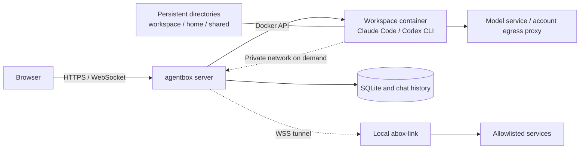

<div align="center">


# agentbox

**Open your browser. Pick up your AI coding work.**

Run Claude Code and Codex CLI on your own server.<br />
Chat, terminal, files, and code review share one persistent workspace.

[](go.mod)
[](package.json)
[](images/agent/Dockerfile)
[](internal/store)
[](LICENSE)

**English** | [简体中文](README_CN.md)

[Screenshots](#screenshots) · [Quick start](#quick-start) · [Documentation](#documentation) · [Deployment and operations](deploy/README.md) · [Report an issue](https://github.com/devilcoolyue/agentbox/issues)

</div>

<picture>
  <source media="(prefers-color-scheme: light)" srcset="docs/images/chat-light.png" />
  
</picture>

<p align="center"><sub>From a task to code you can review. Chat, terminal, files, and Git in one workspace.</sub></p>

## Why agentbox?

| What you want to do | How agentbox helps |
| --- | --- |
| **Resume coding anywhere** | Connect to persistent workspaces from your browser; code, home configuration, and chat history stay on your server |
| **Use familiar agents** | Switch between streaming Web chat and the original Claude Code or Codex CLI terminal |
| **Take a task through delivery** | Upload a project → assign a task → preview files → review Git diffs → commit or download |
| **Reuse environments and resources** | Per-user `/shared` directories, two layers of home templates, Claude skill management, and MCP configuration |
| **Manage accounts and costs centrally** | OAuth / API key / relay account pools, per-user access, usage details, pricing catalog updates, historical price snapshots, and a credit ledger |
| **Reach your private network** | Optional abox-link gives cloud agents access to allowlisted repositories, databases, and services; check the connection status and details from the chat bar |

The server is a **single Go binary with an embedded frontend**, using SQLite for state and Docker to isolate workspaces, with systemd deployment and backup tools included.

## Screenshots

These are **browser screenshots of the current source UI**, using synthetic projects, conversations, terminal output, and usage data. They contain no real accounts or business records and do not represent live model results. Released versions may differ from the current source. Click an image to enlarge it. The app interface is currently in Chinese.

| From task to code | From code to delivery |
| --- | --- |
| [](docs/images/terminal.png) | [](docs/images/changes.png) |
| **Terminal · Keep your working session**<br>Run commands, use the original CLI, and reattach to tmux after a disconnect. | **Changes · Review every edit**<br>Browse diffs and complete files, then commit after review. |
| [](docs/images/files.png) | [](docs/images/usage.png) |
| **Files · Manage source and artifacts**<br>Edit, preview, and download archives from project and shared directories. The source viewer includes line numbers, syntax highlighting, current-line highlighting, line/column navigation, and fullscreen mode. | **Usage · Understand your costs**<br>Filter by user, model, and time; inspect pricing sources and turn latency. |
| [](docs/images/accounts.png) | [](docs/images/tunnel.png) |
| **Accounts · Manage access centrally**<br>Maintain Claude / Codex accounts and control which users may use them. | **Private network · Reach services accessible from your computer**<br>Access allowed targets transparently and inspect client and workspace network status. |

<details>
<summary><strong>Light theme and mobile UI</strong></summary>

Choose system, light, or dark themes. Narrow screens use drawer navigation, and touch terminals include a shortcut key bar.


</details>

See the [development guide](docs/development.md#文档截图) for instructions to reproduce these screenshots.

## Choose your entry point

| Entry point | Best for | What to install |
| --- | --- | --- |
| **Browser chat** | Assign coding tasks, view streaming results, and manage multiple conversations | Users only need a browser; an administrator deploys the server first |
| **Browser terminal** | Use the original CLI, run commands, and install project dependencies | CLIs and common tools are included in the workspace image |
| **agentbox-client for macOS** | Native terminal, per-project Claude, drag-and-drop upload, and bidirectional local project sync | Build from source; see [macOS client](macos/README.md) |
| **abox-link local panel** | Let cloud workspaces access private services reachable from your computer | Run `abox-link` on your computer |
| **abox-link command line** | Configure allowlists and port mappings on a headless machine | Use the same `abox-link` binary with `--server` |
| **HTTP / WebSocket API** | Integrate scripts, manage workspaces, and read usage records | Use the Bearer token obtained after login |

`abox-link` is optional. You do not need to install it for regular browser use.

## How it works



Each workspace has a container and a set of persistent directories. A workspace can have multiple chat threads, but only one Web chat turn runs at a time. Each user's shared directory is mounted at `/shared` in all of their workspaces.

The console supports page deep links, light and dark themes, and mobile access. On mobile, System settings and Git management use a submenu switcher at the top right; toolbars use icons, less frequent actions live under More, and long-pressing an icon shows its description. File previews keep a close control visible, and diff details provide a way back to the file list. Desktop layouts retain text actions and split navigation. Chat supports model and reasoning-effort selection; each response shows its time, model, settings snapshot, and recorded cost. See the [workspace guide](docs/user-guide.md) for full instructions.

## Quick start

### Install with one command (release packages)

Run on a Linux server:

```bash
curl -fsSL https://raw.githubusercontent.com/devilcoolyue/agentbox/main/install.sh | sudo bash
```

The current stable release is [v0.1.5](https://github.com/devilcoolyue/agentbox/releases/tag/v0.1.5). The installer selects the latest stable release by default. Append `-s -- --version v0.1.5` to pin this version.

On SELinux systems such as Oracle Linux / RHEL, if an older package fails to start with `203/EXEC` / `Permission denied`, follow [SELinux installation recovery](deploy/README.md#selinux-安装恢复) to repair executable labels before retrying activation.

The installer supports Linux x86_64 / arm64 with systemd. On Ubuntu 22.04+ and Debian 12+, it installs missing dependencies and Docker automatically. Other distributions require Python 3.9+, Git, curl, CA certificates, timezone data, and a local Docker Engine to be installed first. The server uses prebuilt packages, so Go and Node are not required on the server.

The command verifies the release package, builds a workspace image with pinned versions, generates configuration and a random administrator password, and installs and starts `agentbox.service`. The first image build takes a few minutes and requires access to container registries, Debian package repositories, and npm. Once complete, open `http://YOUR_SERVER_IP:8180`, sign in as `boxadmin` with the initial password printed in the terminal, and add an account under System settings → Account pool (`系统设置 → 账号池`). For remote access, allow TCP 8180 through your firewall / security group. Configure HTTPS for ongoing public access.

Append `-s -- --listen 127.0.0.1:8180` to restrict access to the local machine or a reverse proxy. Configuration and data are stored in `/etc/agentbox` and `/var/lib/agentbox`. If an existing deployment is detected, the installer stops and preserves its files. See the [installation guide](deploy/README.md#一键安装) for upgrades, recovery, and all options.

<details>
<summary><strong>Developers: build and deploy from source</strong></summary>

The project is licensed under [Apache-2.0](LICENSE). You are welcome to build, modify, and contribute. Use the prebuilt installer above to get started as a user, or read the [contribution guide](CONTRIBUTING.md) to work on the source.

### 1. Prepare a Linux server

| Dependency | Purpose |
| --- | --- |
| Linux + Docker Engine | Run the server and workspace containers; production hosting uses systemd |
| Go 1.26.6 or a compatible automatic toolchain | Build the server from source; [go.mod](go.mod) is the version reference |
| Git | Fetch source, review Git changes, and retrieve skill marketplace content |
| Python 3, curl, iproute2 (`ss`) | Deployment, health checks, and backup scripts |
| OpenSSL | Generate the initial administrator password |
| Node.js 22 / npm (optional) | Only needed when editing the main console's TypeScript |

The deployment machine does not need to compile the frontend: generated files in `internal/web/static/js/` are committed and embedded in the Go binary. Backups use the binary's built-in SQLite online backup API; scheduled backup rotation uses Python 3.

Each container defaults to **2048 MiB of memory, 2 CPUs, and 512 processes**. Reserve server resources based on the number of concurrent workspaces. macOS supports builds and unit tests; full container and systemd deployments target Linux.

### 2. Get the source and build

```bash
git clone https://github.com/devilcoolyue/agentbox.git
cd agentbox

go build -o agentbox ./cmd/agentbox
./scripts/build-image.sh
```

Image builds require access to the base image registry, Debian package repositories, and npm. The user running the build needs Docker access. At startup, the server also needs to set mounted directory ownership to `1000:1000`; the supplied systemd unit runs as root.

### 3. Initialize configuration

```bash
cp config.example.json config.json
openssl rand -hex 24
```

Edit `config.json`:

1. Replace `auth_token` with the generated random string. It becomes the initial `boxadmin` password on first startup.
2. For a first try, set both `accounts` and `proxies` to `[]`, then add real accounts in the Web UI after login. The example proxy addresses and keys are placeholders and cannot be used as-is.
3. Keep `listen: "127.0.0.1:8180"`. Data defaults to the `data/` directory next to the configuration file.

You can use this minimal configuration after replacing the password placeholder:

```json
{
  "listen": "127.0.0.1:8180",
  "auth_token": "CHANGE_ME_TO_A_LONG_RANDOM_TOKEN",
  "data_dir": "data",
  "agent_image": "agentbox-agent:latest",
  "accounts": [],
  "proxies": []
}
```

Startup validation rejects the placeholder password. See the [configuration reference](docs/configuration.md) for all fields, defaults, and when changes take effect.

### 4. Start and sign in

Try running in the foreground from the repository directory on the Linux server:

```bash
sudo ./agentbox -config config.json
```

On the server itself, open **<http://127.0.0.1:8180>**. For a remote server, open another terminal on your computer and set up SSH forwarding:

```bash
ssh -N -L 8180:127.0.0.1:8180 user@your-server
```

Then open the same address in your local browser and sign in with **`boxadmin` and the configured `auth_token`**. After the account is created, its password is stored in the database; changing `auth_token` does not reset the login password.

### 5. Add an account and create your first workspace

1. Open System settings → Account pool (`系统设置 → 账号池`) and add a Claude or Codex account.
2. Choose Subscription OAuth or API key / relay in the same dialog, and configure its name, access scope, and egress proxy. For Claude subscriptions, paste the authorization code; for Codex subscriptions, paste the complete callback URL. For API / relay accounts, enter the endpoint and key. See [accounts and models](docs/accounts-and-models.md).
3. Open Workspace configuration (`工作空间配置`) to create a workspace and select an existing agent and account. Existing account, proxy, and container configuration is unchanged.
4. On the Projects homepage (`项目`), select New project (`新建项目`) and choose its workspace. Projects share that workspace's account, egress proxy, and container; each has a directory under `/workspace` and its own Agent terminal.
5. Open a project to work in its Agent terminal. Space files (`空间文件`) can browse the entire workspace; Web chat, history, and Git review remain workspace-scoped and are accessed through the workspace shortcut. Local sync paths are managed by the Mac client, not the browser.

### 6. Run as a service

After stopping the foreground trial, run from the repository directory:

```bash
sudo ./deploy/install.sh
sudo ./deploy/deploy.sh
```

Administrators can check for new versions through the sidebar version entry or System settings → About and updates (`系统设置 → 关于与更新`). Standard Linux/systemd release installations support Upgrade and restart, with automatic verification, backups, and progress reporting. Source installations continue to use deployment scripts. See [releases and upgrades](docs/releases.md#控制台更新提示).

`install.sh` installs the service and timers; automatic workspace image updates are disabled by default. `deploy.sh` builds and replaces binaries, restarts the service, and checks its health. For ongoing remote access, configure HTTPS and a WebSocket reverse proxy. See [deployment and operations](deploy/README.md).

For uninstalling and reinstalling, see [downloads and installation](deploy/downloads/README.md#一键卸载与重新安装). Uninstall preserves all files in a private backup directory by default; `--purge` deletes them permanently. Since v0.1.1, release packages include abox-link for five platforms, and installation / upgrades place the client downloads automatically.

</details>

## Users and permissions

| Capability | Regular users | Administrators |
| --- | --- | --- |
| Create workspaces; use chat, terminal, files, and skills | Own workspaces | Own workspaces |
| Use shared directories, home templates, and private-network tunnels | Own resources | Own resources |
| Select an account from the pool | Authorized accounts only | All accounts |
| View usage records | Own records | All users |
| Manage credentials, egress proxies, models, pricing, and system configuration | No | Yes |
| Create users, reset passwords, and manage credit limits | No | Yes |

Administrators maintain the account pool. Each account has one of three access scopes: all users, selected users, or administrators only, configured through its Access scope control. Older configurations without this setting remain shared with all users. Administrators can always use all accounts, but their workspace API requests are still checked against workspace ownership; system administration does not grant an interface for browsing other users' workspaces. Server administrators can still access persistent data on the host directly.

Revoking account access blocks new operations and further credential synchronization. It does not withdraw credentials already delivered or terminate running processes; complete revocation also requires stopping the relevant containers and rotating upstream credentials. Account credentials are provided to the CLI inside containers, and users with terminal access can read them. Shared account pools are therefore intended for trusted users; do not share administrator subscriptions or API credentials with untrusted users.

## Current support

| Capability | Claude Code | Codex CLI |
| --- | --- | --- |
| Web chat and multiple chat threads | Supported through streaming headless turns | Supported; prefers app-server, falling back to exec if the handshake fails |
| Original CLI terminal | Supported | Supported |
| Subscription authorization in the Web UI | OAuth authorization code flow | OAuth callback URL flow |
| API key / relay configuration | Supported | Supported; must match the provider protocol |
| Usage for Web chat and automatic titles | Supported | Supported; costs are calculated from configured pricing |
| Terminal usage backfill | Recorded without deducting credits | Supports codex-tui rollouts; recorded without deducting credits |
| Web skill management | Supports `.claude/skills` | Configure through the CLI and home templates |

A few operational boundaries:

- **Persistent files do not imply persistent processes.** You can reconnect after a terminal network disconnect, but stopping or rebuilding a container terminates its processes. Store files you need to keep in `/workspace`, `/home/agent`, or `/shared`.
- **Credit limits are not real-time hard caps.** Web turns settle when they finish, so the turn that exhausts a balance may overspend. Claude / Codex terminal usage backfill does not deduct credits.
- **Default system backups exclude workspace data.** They cover the database, configuration, account credentials, and both template layers. `agentbox backup --full` also includes user files and history and requires stopping the service and relevant containers first. Use `backup-verify` to verify backups and `restore --to` to restore into a new directory. See [backup and restore](deploy/README.md#备份与恢复).
- **Production deployment briefly disconnects clients.** The current architecture uses one machine, one server process, and a local Docker daemon. Only one agentbox process may use a given `data_dir`.
- **Agents can execute code in containers.** The default permission mode is `bypassPermissions`. Containers run as a non-root user with resource limits and `no-new-privileges`. The server has Docker access and is intended to be deployed and maintained by trusted administrators.
- **Git review runs inside workspace containers.** Opening review starts the workspace if necessary and applies the same credit admission checks as terminal access. Web commits do not run Git hooks or signing; use the terminal if you need them.
- **Commit locally in the Web UI does not push to a remote.** Set the shared name / email for your Web commits through Git management → Commit identity in the user menu, or Git identity on the Changes page; defaults are your username and `username@localhost`. Remote ahead / behind counts come from the local cache; refreshing does not fetch. Git management is a separate page available to regular users, at the same level as System settings, with a guide, commit identity, and repository connections. It supports page refresh and browser back / forward navigation; connections and authorizations are managed within the page. Repository connections support HTTPS tokens and SSH private keys. Clone repositories from Changes; use Remote to bind a connection, fetch, pull by fast-forward, or preview and push. Administrators can register GitHub / GitLab OAuth apps so users can authorize reusable connections in the browser. Operations report progress and can be canceled. Enterprise Git supports company CAs and user private-network tunnels; SSH pins server host keys. Web branch management supports creation, switching, upstream configuration, and deletion of merged branches. GitHub / GitLab PR / MR creation includes a preview. Administrators can share dedicated service accounts with per-user read / write limits. A 30-minute terminal authorization is also available; long-term credentials remain on the server. Connections belong to users, workspaces select a default, and repositories bind connections per remote. See the [Git management notes](docs/architecture/git-management.md) for implementation boundaries and the [maintenance guide](docs/development.md#git-密钥维护与容器网桥验收) for offline key rotation.
- **Web file operations do not follow symbolic links.** Workspaces, shared directories, skills, and credential files use restricted directory handles. Uploads are validated in temporary directories, and editor saves use atomic replacement. Container CLIs can still use links from templates.

## Deployment layout and operations

New installations can use versioned release directories, with configuration, data, and marketplace cache stored in `/etc/agentbox`, `/var/lib/agentbox`, and `/var/cache/agentbox`. Deployments inside the source repository remain supported. The [deployment layout and migration guide](docs/architecture/deployment-layout.md) covers installation, upgrades, rollback, offline migration, and backups.

Pricing in System settings supports a separate HTTPS pricing catalog, daily checks, reviewing and applying changes, protection for custom prices, and version rollback. Publish catalog JSON to add models or update prices without upgrading the server. Remote sources must be configured explicitly; the bundled older snapshot is not a claim of current prices. See [pricing catalog maintenance](docs/pricing-catalog.md).

Containers and resources in System settings provides global / per-user running container limits, reserved disk space, background disk usage statistics, marketplace cache cleanup, and sanitized diagnostic downloads. The usage page reads recorded entries and shows the terminal scan time; backfill runs in the background.

Claude web chat deduplicates usage by message ID, completes usage from new transcript records, and prices each request using the table pinned at turn start. Resumed session totals are never charged again. Message identities and credit deductions commit together (database schema 9). Existing history is not automatically repriced. Usage details and CSV include cache hit rate: cache reads / (uncached input + cache reads + cache writes); no input displays “—”.

## Documentation

The English and Chinese READMEs cover the same features and setup steps. Detailed guides are currently available in **Chinese**. Start with the [documentation index](docs/README.md) for guidance by role.

| Guide | Contents |
| --- | --- |
| [Workspace guide](docs/user-guide.md) | Chat, terminal, files, HTML previews, Git review, and shared directories |
| [Accounts and models](docs/accounts-and-models.md) | OAuth, API keys, Codex credentials, default models, and account lifecycle |
| [Configuration reference](docs/configuration.md) | Fields, defaults, persistent directories, and when changes take effect |
| [Skills, plugins, and MCP](docs/skills-and-mcp.md) | Skill management, official marketplace, two-layer home templates, and MCP configuration |
| [Usage and credits](docs/usage-and-quotas.md) | Reporting semantics, cost details, pricing, top-ups, overspending, and CSV |
| [Egress proxies and private-network tunnels](docs/networking.md) | Proxy pools, abox-link pairing, allowlists, port mappings, and environment variables |
| [Deployment and operations](deploy/README.md) | systemd, HTTPS, updates, backups, recovery, migration, and logs |
| [API reference](docs/api.md) | Login, workspaces, files, chat, usage, and administration |
| [Development guide](docs/development.md) | Repository layout, builds, frontend live reload, tests, and contribution conventions |
| [Releases and compatibility](docs/releases.md) | Package installation, upgrades, rollback, and the [pinned CLI baseline](docs/compatibility.md) |
| [Troubleshooting](docs/troubleshooting.md) | Startup, login, containers, proxies, usage, backups, and frontend issues |

## Tech stack and local development

| Layer | Technology |
| --- | --- |
| Server | Go, HTTP / WebSocket, Docker Engine API |
| Main console | TypeScript, native ES Modules, xterm.js, KaTeX |
| Persistence | SQLite, host directories, JSONL chat history |
| Workspaces | Debian / Node.js image, Claude Code, Codex CLI, tmux |
| Private-network access | abox-link, yamux, WebSocket, SOCKS5, and TCP mappings |
| Deployment | Linux, systemd, HTTPS reverse proxy |

```bash
go build ./...
go test ./...

# When editing the frontend; CI uses Node.js 22
npm ci
npm run check
npm run build
```

When editing `web/src/*.ts`, also commit the generated files in `internal/web/static/js/`. See the [development guide](docs/development.md) for Linux container checks, optional live model tests, and abox-link builds.

See [CONTRIBUTING.md](CONTRIBUTING.md) for contribution steps, [SECURITY.md](SECURITY.md) for private vulnerability reporting, [CHANGELOG.md](CHANGELOG.md) for changes, and [third_party/](third_party/README.md) for third-party licenses. Binary candidates and installation workflows are described in the [release guide](docs/releases.md); pinned CLI versions are listed in the [compatibility matrix](docs/compatibility.md).

Focused issues and pull requests are welcome. Include your platform, source revision, reproduction steps, and sanitized logs. Keep real credentials, user files, and databases out of commits and screenshots.

## License

Agentbox is licensed under [Apache-2.0](LICENSE); see [NOTICE](NOTICE) for copyright notices. Third-party components retain their own licenses. Model services and runtime CLIs remain subject to their upstream usage and redistribution terms; see the [third-party notes](third_party/README.md).

## Community links

Thanks to the LINUX DO community for its support and discussions.

- [LINUX DO](https://linux.do) - A new kind of ideal community
