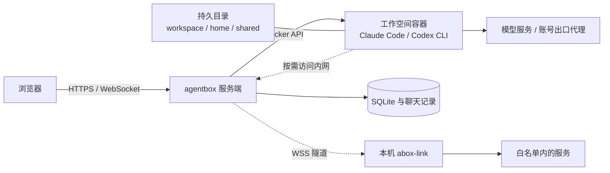

<div align="center">


# agentbox

**打开浏览器，继续你的 AI 编码工作。**

在自己的服务器上运行 Claude Code 与 Codex CLI。<br />
对话、终端、文件与代码审查，共用一个持久化工作空间。

[](go.mod)
[](package.json)
[](images/agent/Dockerfile)
[](internal/store)
[](LICENSE)

[English](README.md) | **简体中文**

[界面预览](#界面预览) · [快速开始](#快速开始) · [使用文档](#使用文档) · [部署与运维](deploy/README.md) · [反馈问题](https://github.com/devilcoolyue/agentbox/issues)

</div>

<picture>
  <source media="(prefers-color-scheme: light)" srcset="docs/images/chat-light.png" />
  
</picture>

<p align="center"><sub>从一句任务，到可审查的代码。对话、终端、文件与 Git，都在同一个工作空间。</sub></p>

## 为什么使用 agentbox？

| 你要做的事 | agentbox 提供的工作方式 |
| --- | --- |
| **随时继续编码** | 浏览器连接持久化工作空间；代码、home 配置和对话历史留在自己的服务器 |
| **用熟悉的 Agent** | Claude Code 与 Codex CLI，网页流式对话和原版 CLI 终端自由切换 |
| **完成交付闭环** | 上传项目 → 下发任务 → 预览文件 → 审查 Git diff → 提交或下载 |
| **复用环境和资源** | 用户级 `/shared`、双层 home 模板、Claude 技能管理与支持空间覆盖的用户级 MCP 管理 |
| **集中管理账号与成本** | OAuth / API Key / 中转账号池、按用户授权、用量明细、价格目录更新、历史价格快照和额度账本 |
| **访问自己的内网** | 可选 abox-link，让云端 Agent 直接访问白名单内的代码仓库、数据库和服务；对话栏显示连接状态，点击查看详情 |

服务端是嵌入前端的 **Go 单二进制**，以 SQLite 保存状态、Docker 隔离工作空间，配套 systemd 部署与备份工具。

## 界面预览

以下为**当前源码界面的浏览器截图**，使用合成项目、对话、终端输出与用量数据，不包含真实账号或业务记录；不代表模型实测结果。已发布版本可能与当前源码有所不同。点击图片查看大图。应用界面目前为中文。

| 从任务到代码 | 从代码到交付 |
| --- | --- |
| [](docs/images/terminal.png) | [](docs/images/changes.png) |
| **终端 · 保留你的工作现场**<br>执行命令，使用原版 CLI，断线后重新附着 tmux。 | **变更 · 看清每一处修改**<br>浏览 diff 与完整文件，审查后提交。 |
| [](docs/images/files.png) | [](docs/images/usage.png) |
| **文件 · 管理源码与产物**<br>项目目录与用户共享目录，支持编辑、预览和打包下载；源码视图提供行号、语法着色、当前行高亮、行列定位和全屏查看。 | **用量 · 费用有据可查**<br>按用户、模型和时间筛选，查看计价来源与回合延迟。 |
| [](docs/images/accounts.png) | [](docs/images/tunnel.png) |
| **账号 · 统一接入与授权**<br>维护 Claude / Codex 账号，控制用户使用范围。 | **内网 · 连接本机可达的服务**<br>透明访问已放行目标，查看客户端与工作空间网络状态。 |

<details>
<summary><strong>浅色主题与手机界面</strong></summary>

支持跟随系统、浅色和深色主题；窄屏提供抽屉导航，触屏终端另有快捷键栏。


</details>

截图的复现方法见[开发指南](docs/development.md#文档截图)。

## 选择适合你的入口

| 入口 | 适合做什么 | 需要安装什么 |
| --- | --- | --- |
| **浏览器对话** | 下发编码任务、查看流式结果、管理多条对话 | 用户只需浏览器；管理员先部署服务端 |
| **浏览器终端** | 使用原版 CLI、执行命令、安装项目依赖 | CLI 和常用工具已包含在工作空间镜像中 |
| **agentbox-client（macOS）** | 原生终端、按项目启动 Claude、拖拽上传、本地项目双向同步 | 从源码构建，见 [macOS 客户端](macos/README.md) |
| **abox-link 本机面板** | 让云端工作空间访问本机可达的内网 | 在自己的电脑上运行 `abox-link` |
| **abox-link 命令行** | 在无头机器上配置内网白名单与端口映射 | 同一个 `abox-link` 二进制，传入 `--server` |
| **HTTP / WebSocket API** | 接入脚本、管理空间与读取使用记录 | 使用登录后取得的 Bearer token |

`abox-link` 是可选的内网连接工具；普通浏览器使用不需要安装它。

## 工作方式



一个工作空间对应一个容器和一组持久目录；同一空间可以有多条对话线程，但同一时刻只运行一个网页对话回合。用户级共享目录在该用户的所有空间中挂载为 `/shared`。

控制台支持页面深链接、深浅主题和手机访问。手机端系统设置与 Git 管理在顶栏右侧切换子菜单；工具栏使用图标，低频操作收进「更多」，长按图标可查看说明。文件预览提供固定关闭入口，变更页点击文件进入差异详情后可返回列表；桌面端保留文字操作与分栏导航。对话可选模型与推理强度，每轮回答显示时间、模型、设置快照与已入账费用；完整操作见[工作空间使用指南](docs/user-guide.md)。

## 快速开始

### 一条命令安装（发布包入口）

在 Linux 服务器上执行：

```bash
curl -fsSL https://raw.githubusercontent.com/devilcoolyue/agentbox/main/install.sh | sudo bash
```

当前正式版本为 [v0.1.7](https://github.com/devilcoolyue/agentbox/releases/tag/v0.1.7)。安装命令默认选择最新正式发布；固定安装此版本可在命令末尾加 `-s -- --version v0.1.7`。

Oracle Linux / RHEL 等启用 SELinux 的系统，若旧版安装包启动时报 `203/EXEC` / `Permission denied`，按[SELinux 安装恢复](deploy/README.md#selinux-安装恢复)修复程序标签后重试激活。

安装器支持 Linux x86_64 / arm64 + systemd；Ubuntu 22.04+、Debian 12+ 自动安装缺失依赖和 Docker，其他发行版需预先安装 Python 3.9+、Git、curl、CA 证书、时区数据和本机 Docker Engine。服务端使用预编译包，无需在服务器安装 Go 或 Node。

命令会校验发布包、构建固定版本工作空间镜像、生成配置和随机管理员密码、安装并启动 `agentbox.service`。首次构建镜像需要几分钟及对镜像仓库、Debian 软件源和 npm 的网络访问。完成后打开 `http://服务器IP:8180`，使用终端显示的 `boxadmin` 和初始密码登录，在「系统设置 → 账号池」添加账号。远程访问需放行防火墙/安全组的 TCP 8180，公网长期使用请配置 HTTPS。

可在命令末尾加 `-s -- --listen 127.0.0.1:8180`，只允许本机或反向代理访问。配置、数据分别存放在 `/etc/agentbox`、`/var/lib/agentbox`。已有部署会停止安装并保留原文件；升级、失败恢复和完整选项见[一键安装说明](deploy/README.md#一键安装)。

<details>
<summary><strong>开发者：从源码构建与部署</strong></summary>

项目采用 [Apache-2.0](LICENSE) 许可证，欢迎从源码构建、修改和贡献。希望直接使用的用户可选择上方预编译安装包；参与开发请参阅[贡献指南](CONTRIBUTING.md)。

### 1. 准备 Linux 服务器

| 依赖 | 用途 |
| --- | --- |
| Linux + Docker Engine | 运行服务端与工作空间容器；生产托管使用 systemd |
| Go 1.26.6 或兼容的自动工具链 | 从源码构建服务端，版本以 [go.mod](go.mod) 为准 |
| Git | 拉取源码、Git 变更审查、获取技能市场内容 |
| Python 3、curl、iproute2（`ss`） | 发布、探活和备份脚本 |
| OpenSSL | 生成初始管理员密码 |
| Node.js 22 / npm（可选） | 仅修改主控制台 TypeScript 时需要 |

部署机无需编译前端：`internal/web/static/js/` 的产物已经提交，并随 Go 二进制嵌入。备份由二进制内置 SQLite 在线备份 API 完成，定时脚本的轮转使用 Python 3。

每个容器默认限制为 **2048 MiB 内存、2 CPU、512 个进程**；按并发空间数为服务器预留资源。macOS 可用于构建和单元测试，完整容器与 systemd 部署以 Linux 为目标。

### 2. 获取源码并构建

```bash
git clone https://github.com/devilcoolyue/agentbox.git
cd agentbox

go build -o agentbox ./cmd/agentbox
./scripts/build-image.sh
```

镜像构建需要访问基础镜像仓库、Debian 软件源和 npm。构建用户应有 Docker 访问权限；服务启动时还需要为挂载目录设置 `1000:1000` 属主，配套 systemd 单元以 root 运行。

### 3. 初始化配置

```bash
cp config.example.json config.json
openssl rand -hex 24
```

编辑 `config.json`：

1. 将 `auth_token` 换成刚生成的随机字符串，它是首次启动时 `boxadmin` 的初始密码。
2. 初次体验可将 `accounts` 与 `proxies` 都设为 `[]`，登录后从网页添加真实账号。示例中的代理地址与密钥均为占位内容，不能直接使用。
3. 保留 `listen: "127.0.0.1:8180"`，数据默认写入配置文件所在目录下的 `data/`。

可直接使用以下最小配置，先替换密码占位符：

```json
{
  "listen": "127.0.0.1:8180",
  "auth_token": "CHANGE_ME_TO_A_LONG_RANDOM_TOKEN",
  "data_dir": "data",
  "agent_image": "agentbox-agent:latest",
  "accounts": [],
  "proxies": []
}
```

密码占位符会被启动校验拒绝。完整字段、默认值与生效时机见[配置参考](docs/configuration.md)。

### 4. 启动并登录

在 Linux 服务器的仓库目录前台试跑：

```bash
sudo ./agentbox -config config.json
```

服务器本机访问 **<http://127.0.0.1:8180>**。若服务器在远端，可以在自己的电脑另开终端，通过 SSH 转发访问：

```bash
ssh -N -L 8180:127.0.0.1:8180 user@your-server
```

然后在本机浏览器打开相同地址，使用 **`boxadmin` + 配置中的 `auth_token`** 登录。首次建号以后，密码保存在数据库中，修改 `auth_token` 不会重置登录密码。

### 5. 添加账号，创建第一个空间

1. 打开「系统设置 → 账号池」，新增 Claude 或 Codex 账号。
2. 在同一弹窗选择「订阅 OAuth」或「API Key / 中转」，同时配置名称、使用范围与出口代理。Claude 订阅粘贴授权码；Codex 订阅粘贴完整回调地址；API / 中转账号填写地址与 Key。具体见[账号与模型](docs/accounts-and-models.md)。
3. 打开「工作空间配置」创建工作空间，选择已有 Agent 与账号。现有账号、代理和容器配置保持不变。
4. 在「项目」首页点击「新建项目」，选择所属工作空间。项目共享空间的账号、出口代理和容器，各自拥有 `/workspace` 下的目录与独立 Agent 终端。
5. 打开项目进入 Agent 终端。「空间文件」可浏览整个工作空间；网页对话、历史和 Git 审查仍属于工作空间，通过侧栏的空间快捷入口使用。本地同步路径由 Mac 客户端管理，不在网页中设置。

### 6. 转为长期运行

结束前台试跑后，在仓库目录执行：

```bash
sudo ./deploy/install.sh
sudo ./deploy/deploy.sh
```

管理员可在侧栏版本入口或「系统设置 → 关于与更新」查看新版本提示。标准 Linux/systemd 版本目录安装支持「升级并重启」，自动校验、备份并显示升级进度；此布局下的开发版、预发布版及带未提交改动的构建也可直接切换到最新正式版，即使正式版版本号较低，配置或数据库不兼容时会阻止切换；源码安装仍使用部署脚本，见[版本发布与升级](docs/releases.md#控制台更新提示)。

`install.sh` 安装服务与定时器，镜像自动追新默认关闭；`deploy.sh` 构建、替换二进制、重启并探活。远程长期访问请配置 HTTPS 与 WebSocket 反向代理，完整步骤见[部署与运维](deploy/README.md)。

管理员可在「系统设置 → 容器与资源 → 客户端更新」配置每日自动更新、Claude `stable` / `latest` 渠道与系统时区下的检查时间，也可立即检查、更新或回退上次镜像。默认关闭自动更新，Claude 默认 `stable`，Codex 默认保持当前版本；可单独选择同时更新 Codex 到 `latest`。服务端内置调度，无需 systemd 更新定时器或源码目录。更新基于当前镜像保留浏览器与自定义功能，通过 CLI 版本验证后才切换；运行中的空间不打断，停止再启动后使用新镜像。失败保留当前镜像，回退会暂停自动更新。详见[客户端镜像更新](deploy/README.md#客户端镜像更新)。


一键卸载与重新安装见[下载与安装说明](deploy/downloads/README.md#一键卸载与重新安装)。卸载默认保留全部文件到私有备份目录；`--purge` 才彻底删除。v0.1.1 起发布包附带五个平台的 abox-link，安装/升级自动放置客户端下载文件。

</details>

## 用户与权限

| 能力 | 普通用户 | 管理员 |
| --- | --- | --- |
| 创建空间、对话、终端、文件与技能管理 | 自己的空间 | 自己的空间 |
| 使用共享目录、用户 home 模板、内网隧道 | 自己的资源 | 自己的资源 |
| 选择账号池中的账号 | 仅授权范围内 | 全部账号 |
| 查看使用记录 | 自己的记录 | 全部用户的记录 |
| 管理账号凭证、出口代理、模型、价格与系统配置 | 不可以 | 可以 |
| 创建用户、重置用户密码、管理额度 | 不可以 | 可以 |

账号池由管理员统一维护，每个账号支持「全体用户」「指定用户」「仅管理员」三种使用范围，在账号行的「使用范围」按钮设置。旧配置未设置范围时保持全体共享；管理员始终可用。管理员的工作空间 API 同样受属主校验；系统管理权限不提供跨用户的空间浏览入口。服务器管理员仍可直接访问宿主机持久数据。

撤销账号授权会阻止新操作和后续凭证同步，已交付的凭证及已启动的进程不会自动撤回；彻底撤销还需停止相关容器并在上游轮换凭证。账号凭证会提供给容器内的 CLI，拥有终端访问权的用户可以读取这些凭证。因此，共享账号池适用于可信用户；不要将管理员的订阅或 API 凭证分享给不可信用户。

## 当前支持范围

| 能力 | Claude Code | Codex CLI |
| --- | --- | --- |
| 网页对话与多线程历史 | 支持，使用流式无头回合 | 支持，优先 app-server，握手失败时回退 exec |
| 原版 CLI 终端 | 支持 | 支持 |
| 网页订阅授权 | 支持 OAuth 授权码流程 | 支持 OAuth 回调地址流程 |
| API Key / 中转配置 | 支持 | 支持，需匹配 provider 协议 |
| 网页对话与自动起标题用量 | 支持 | 支持；费用需按价目表折算 |
| 终端用量补记 | 支持，只记录、不扣余额 | 支持 codex-tui rollout，只记录、不扣余额 |
| 网页技能管理 | 支持 `.claude/skills` | 使用 CLI 和 home 模板配置 |
| 网页 MCP 管理 | 用户默认配置、空间覆盖、stdio/HTTP 连接检测与工具发现 | 使用 CLI 配置 |

还有几项使用边界：

- **文件持久化不等于进程持久化。** 终端网络断开可续接；停止或重建容器会终止其中进程。应把需要保留的内容放在 `/workspace`、`/home/agent` 或 `/shared`。
- **额度不是实时硬上限。** 网页回合结束时结算，余额见底的这一轮可能超支；Claude/Codex 终端补记都不扣余额。
- **默认系统备份不包含工作区。** 系统备份覆盖数据库、配置、账号凭证与双层模板；`agentbox backup --full` 额外覆盖用户文件和历史，需要先停止服务及相关容器。提供 `backup-verify` 校验和 `restore --to` 恢复到新目录，见[备份与恢复](deploy/README.md#备份与恢复)。
- **生产发布会短暂断开连接。** 当前采用单机、单服务进程与本机 Docker，同一 `data_dir` 只允许一个 agentbox 进程。
- **容器允许 Agent 执行代码。** 默认权限模式为 `bypassPermissions`。容器以非 root 用户运行，设置资源限制与 `no-new-privileges`；服务端具有 Docker 权限，适合由可信管理员部署和维护。
- **Git 审查在会话容器内执行。** 进入审查会按需启动空间，并遵循终端相同的额度入口限制；网页提交不执行 Git hook 或签名，需要这些功能时请在终端提交。
- **远程浏览器**：工作空间的「浏览器」页签提供完整浏览器桌面，可登录 Claude、ChatGPT 或其他网站，按空间保留登录状态；顶部采用紧凑网址工具栏，支持多标签、全屏、流畅/均衡/清晰画质、UTF-8 剪贴板及工作区下载。管理员需构建并选用 `agentbox-agent:browser` 镜像，Linux amd64 默认 Google Chrome，ARM 使用 Chromium。浏览器沿用账号代理、空间权限与资源限制；网页登录与 CLI 授权独立。见[启用与使用说明](docs/remote-browser.md)。
- **网页「提交到本地」不会推送到远程。** 用户菜单的「Git 管理 → 提交身份」或变更页的「Git 身份」可设置你所有空间共用的网页提交姓名/邮箱；缺省使用当前用户名和 `用户名@localhost`。远程分支领先/落后数量来自本地缓存，刷新不会 fetch。用户菜单的「Git 管理」是独立页面（与系统设置同级，普通用户也可访问），包含使用指南、提交身份和仓库连接；支持刷新恢复页面与浏览器前进/后退，添加、编辑连接及授权管理均在页内完成。「仓库连接」支持 HTTPS Token 和 SSH 私钥，变更页可克隆仓库，「远程」可绑定连接、获取、快进拉取和预览后推送。管理员可注册 GitHub/GitLab OAuth 应用，用户网页授权后复用连接；操作记录支持进度查看与取消。企业 Git 可配置公司 CA 和用户内网隧道；SSH 固定服务器主机公钥。网页分支管理支持创建、切换、上游与删除已合并分支。GitHub/GitLab 支持 PR/MR 预览创建；管理员可共享专用服务账号并按用户限制读写。另提供 30 分钟终端授权；长期凭证保留在服务端。连接按用户管理，空间选默认、仓库按 remote 绑定；实施边界见[Git 管理记录](docs/architecture/git-management.md)，离线密钥轮换见[维护说明](docs/development.md#git-密钥维护与容器网桥验收)。
- **网页文件操作不沿符号链接访问。** 工作区、共享目录、技能和凭证文件使用受限目录句柄；上传先在临时目录验证，编辑器保存以原子替换方式写入。模板中的链接仍可由容器内 CLI 使用。

### Claude MCP 管理

工作空间的 **MCP** 页签通过弹窗新增和编辑（保存失败保留草稿），支持用户统一配置、空间覆盖、`mcpServers` JSON 导入及容器内 stdio/HTTP 连接检测。列表将配置状态与操作分开：测试连接保留文字，编辑、复制、删除使用带提示的图标，开关控制启停。配置在下一回合聊天、终端连接或空间启动时应用；已运行的终端 Claude 需重启。已有原生条目必须显式接管。Header/env 凭证在接口中脱敏，磁盘配置为私有文件（0600），并非加密存储。OAuth 仍走终端，独立检测不复用 CLI OAuth 凭证。用户和空间 MCP 管理文件进入系统备份；运行时 home/OAuth 文件需完整备份。继承、冲突处理、API 与限制见[技能、插件与 MCP](docs/skills-and-mcp.md)。

## 独立部署与运行维护

新安装可使用版本化发布目录，配置、数据和市场缓存分别放在 `/etc/agentbox`、`/var/lib/agentbox`、`/var/cache/agentbox`；仓库内部署继续兼容。[部署目录与迁移手册](docs/architecture/deployment-layout.md) 包含安装、升级、回退、离线迁移与备份步骤。

系统设置的「价目表」可一键配置 models.dev 第三方价格源，也支持自建 HTTPS 目录。服务端每日检查 Anthropic / OpenAI 价格，适配 Claude 1 小时缓存写入和明确的长上下文阶梯；缺失或不支持的价格留待核对。默认确认后应用，可开启自动跟随已选模型（超过 25% 的调价、零价格或阶梯规则变化需手动核对），自定义价格受保护。调价无需重新部署，保留历史单价快照和版本回退；恢复版本会暂停自动跟随。来源需明确配置，内置旧快照不代表最新价格。见[价格目录维护](docs/pricing-catalog.md)。

系统设置的「容器与资源」支持全局/每用户运行容器上限、数据盘保留空间、后台磁盘统计、市场缓存清理与脱敏诊断下载。用量页读取已入账记录并显示终端扫描时间，补记在后台完成。

Claude 网页对话按消息 ID 去重，从本轮新增 transcript 记录补齐用量，按回合开始时锁定的价目表逐请求计价，不再重复扣取续聊会话累计值。消息去重凭据与额度扣减同事务提交（数据库 schema 9），既有历史不会自动重算。使用明细与 CSV 新增缓存命中率：缓存读取 /（未缓存输入 + 缓存读取 + 缓存写入），没有输入时显示“—”。

## 使用文档

中英文 README 覆盖相同的功能与上手流程，详细文档目前均为中文，也可以从[文档目录](docs/README.md)按角色开始阅读。

| 文档 | 内容 |
| --- | --- |
| [工作空间使用指南](docs/user-guide.md) | 对话、终端、文件、HTML 预览、Git 审查与共享目录 |
| [账号与模型](docs/accounts-and-models.md) | OAuth、API Key、Codex 凭证、默认模型与账号生命周期 |
| [配置参考](docs/configuration.md) | 配置字段、默认值、持久目录与生效时机 |
| [技能、插件与 MCP](docs/skills-and-mcp.md) | 技能页、官方市场、双层 home 模板与 MCP 配置 |
| [使用记录与额度](docs/usage-and-quotas.md) | 统计口径、费用明细、价目表、充值、超支行为与 CSV |
| [出口代理与内网隧道](docs/networking.md) | 代理池、abox-link 配对、白名单、端口映射与环境变量 |
| [部署与运维](deploy/README.md) | systemd、HTTPS、更新、备份恢复、迁移与日志 |
| [API 参考](docs/api.md) | 登录、工作空间、文件、聊天、用量与管理接口 |
| [开发指南](docs/development.md) | 仓库结构、构建、前端热加载、测试与贡献约定 |
| [版本与兼容性](docs/releases.md) | 发布包安装、升级回退与 [CLI 固定基线](docs/compatibility.md) |
| [常见问题](docs/troubleshooting.md) | 启动、登录、容器、代理、用量、备份与前端排障 |

## 技术栈与本地开发

| 层次 | 技术 |
| --- | --- |
| 服务端 | Go、HTTP / WebSocket、Docker Engine API |
| 主控制台 | TypeScript、原生 ES Modules、xterm.js、KaTeX |
| 持久化 | SQLite、宿主机文件目录、JSONL 聊天记录 |
| 工作空间 | Debian / Node.js 镜像、Claude Code、Codex CLI、tmux |
| 内网连接 | abox-link、yamux、WebSocket、SOCKS5 与 TCP 映射 |
| 部署 | Linux、systemd、HTTPS 反向代理 |

```bash
go build ./...
go test ./...

# 修改前端时执行；CI 使用 Node.js 22
npm ci
npm run check
npm run build
```

修改 `web/src/*.ts` 后必须一起提交 `internal/web/static/js/` 的构建产物。Linux 容器验证、可选真实模型测试与 abox-link 构建见[开发指南](docs/development.md)。

贡献步骤见 [CONTRIBUTING.md](CONTRIBUTING.md)，漏洞私密报告见 [SECURITY.md](SECURITY.md)，变化记录见 [CHANGELOG.md](CHANGELOG.md)，第三方许可见 [third_party/](third_party/README.md)。二进制候选包与安装流程见 [发布说明](docs/releases.md)，固定 CLI 版本见 [兼容矩阵](docs/compatibility.md)。

欢迎提交聚焦具体问题的 Issue 或 PR。反馈时附上平台、代码提交版本、复现步骤和脱敏日志；真实凭证、用户文件与数据库不要放入提交或截图。

## 许可证

Agentbox 采用 [Apache-2.0](LICENSE)，版权声明见 [NOTICE](NOTICE)。第三方组件保留各自许可；模型服务和运行时 CLI 的使用与再分发遵循其上游条款，详见 [第三方说明](third_party/README.md)。

## 友情链接

感谢 LINUX DO 社区的支持与交流。

- [LINUX DO](https://linux.do) - 新的理想型社区
